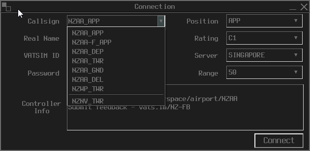
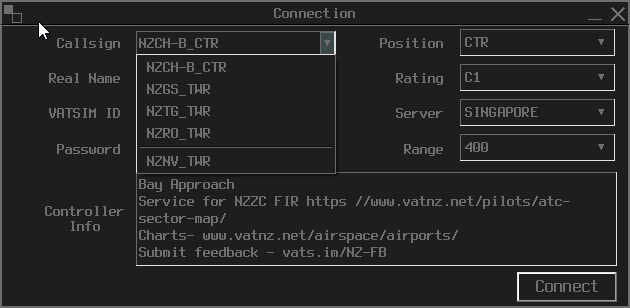

# VATNZ AIRAC Changelog

### 2020 Releases
- [AIRAC 2013](#airac-2013)   
- [AIRAC 2014](#airac-2014)

### 2021 Releases
- [AIRAC 2101](#airac-2101)
- [AIRAC 2102](#airac-2102)
- [AIRAC 2103](#airac-2103)
- [AIRAC 2104](#airac-2104)
- [AIRAC 2105](#airac-2105)
- [AIRAC 2106](#airac-2106)
- [AIRAC 2107](#airac-2107)
- [AIRAC 2108](#airac-2108)
- [AIRAC 2109](#airac-2109)

## AIRAC 2013

### Revision A (Initial)

Initial release of the NZ vatSys profile. 

### Revision B

No recorded changes.

### Revision C

No recorded changes.

### Revision D

No recorded changes.

### Revision E

1. Ground RADAR Views - NV, TG, RO, DN, NP, GS, AP, NR, NS and PM have all been added. Their associated ground radar has also been added. Thanks to Tom, Alek and Cam.

2. CPDLC updates - Small quality of life updates. Thanks to Zain.

3. ATIS Text-to-Speech - Now pulls clouds from the METAR string. Thanks to Zain.

4. Airspace - Fixed an issue where waypoints with the same name that were outside of NZ were being included in a flightplan. Thanks to Alex.

## AIRAC 2014

### Revision A (Initial)

1. Ownership parameters of ACU positions. All TMA positions owned by default. Thanks to Zain.

2. Initial release of [GitHub Contribution Guidelines](CONTRIBUTING.md).

## AIRAC 2101

### Revision A (Initial)

#### ASMGCS 

* Addition of NZPP, NZNE and NZAR ASMGCS views. Added the associated `RADARS.xml` and `Positions.xml` entries. Thanks to Alek and Tom.

* Separated Radar and Aerodrome Ground Views into categories within the Positions tab. Radar views are now categorised by ACU/Enroute and Aerodrome Ground Views are categorised by Class of Airspace (C/D/G). Thanks to Cam and Tom.

* Updating of NZQN ASMGCS views. Thanks to Cam and Tom.

* The following ASMGCS Taxiway, Runway and Apron labels have been added - AA, AP, AR, CH, DN, GS, HN, NE, NP, NR, NS, NV, OH, PM, PP, QN, RO, TG, WB, WN and WP. Thanks to Cam, Alek and Tom.

#### Airspace Additions

* Addition of the following Military Operating Areas (MOAs) - M106, M204, M205, M206, M207, M208, M304, M305, M504 and M507.

* Addition of the following permanent Danger Areas - 121, 125, 130, 235, 323, 522, 621, 626, 711, 718, 719, 721, 726, 727, 820, 821, 822, 823, 827, 921, 925 and 926.

* Addition of STAR overlays for AA, AP, AR, CH, DN, GS, HN, NE, NP, NR, NS, NV, OH, PM, PP, QN, RO, TG, WB, WN and WP.

* Withdrawal of Miranda (RD) NDB, and replacement with waypoint MERAS. ATS Routes, and Auckland NOBAR arrivals updated. H491 and H195 have been withdrawn.

#### Other Changes

* Addition of `<Localhost>` entry in `Profile.xml`, allowing the usage of vatSys as a FR24 viewer. Thanks to Tom and Cam.

* Bug fixed where activation of flight plans do not show up as activated on the APP / ENR controller's scope. Thanks to Zain.

#### Usability Changes

* Change to `README.md` to link to [CONTRIBUTING.md](CONTRIBUTING.md). Thanks to Tom.

* Updated Map file structure to for easier navigation. `_NZ/` folder deleted, with files moved to `Maps/`. ASMGCS files moved to individual folders, sorted by ICAO code. Thanks to Tom.

## AIRAC 2102

### Revision A (Initial)

* Added NZMF in `AIRPORTS.xml`

* Changed the file structure for our Maps, making it more logical and better organised. All referenced links have been updated.

* Made the coastline a little bit darker, in order to better distinguish between the coastline and airspace boundaries.

* Changed the colours of VORs and NDBs. The symbols are now also accurate.

* Changed what Map layers are viewable by default in both Enroute and ACU views. Views should no longer be as cluttered.

### Revision B

* Dataset did not update due to an error that I made. This should fix it.

### Revision C

* VatSys build 0.1.7732.21010 caused some arrival list, and button colours to go out of kilter. Fixed.

### Revision D

* vatSys build 0.1.7735.27676 adds support for custom button select, window border colours and tick styles. Changes have been made so this fals in like with the NZ Dataset.

## AIRAC 2103

### Revision A (Initial)

* Change of Queenstown Ground and Delivery frequencies.

* Addition of various ADS-B radar sites, to bring our coverage further into line with the real-world system.

## AIRAC 2104

### Revision A (Initial)

* **Queenstown** - REDOL2A renamed to the REDOL1B, along with the addition of the SUNGU transition;
* **Queenstown** - Addition of the DOVMA1A departure, RWY 05. 

#### Major Feature Update #1

* All aerodromes in the NZ Domestic FIR have been added.
* All aerodrome procedurs have been added. This includes SIDs, STARs, RNP and GNSS approaches.
* All ATS Routes have been added.
* All VRPs have been added, alongwith VFR arrivals and departures.

### Revision B

Hot fixes for the Anzac Day event.

* **Auckland** - Waypoint BATOS added to the OSRAP1P/MADEP SID.
* **Queenstown** - ANPOV3D renamed to the ANPOV4D.

## AIRAC 2105

### Revision A (Initial)

* The following aerodrome procedures have been added: Glentanner (NZGT), Alexandra (NZLX), Manapouri/Te Anau (NZMO), Takaka (NZTK) and Whitianga (NZWT). As a part of this, some procedural fixes have been added.
  
* Addition of Paraparaumu and Milford FIS as positions. As defined in the Airspace section of the VATNZ website, these are Events Only positions.

* Removal of Dunedin Ground and Delivery positions. 

* Palmerston and Ohakea Ground positions have been added.

* Addition of updated `Performance.xml`, which includes aircraft type information (speeds, climb and descent rates). 

## AIRAC 2106

### Revision A (Initial)

**ANR database updated, with the following changes**:
 * WPT `VAMSU` replaced with WPT `BUGNO`. New Plymouth procedures have been changed (see below).
 * Additon of waypoints `OLGOP`, `IGDAR`, `EMSED`,  `URKEL`, `ELDIB`. 
 * Airways `KQ427`, `H191` and `Y273` amended.
 * Minor changes to controlled airspace bounds.
 * New Whanganui VRPs have been added.

**New Plymouth (NZNP) Changes**
Mainly changes to bring the procedure notation in line with convention, and to reflect the replacement of WPT `VAMSU` with `BUGNO`.

 * **VISAD 3A** replaces VISAD 2A.
 * **BUGNO 1B** replaces VAMSU 2B.
 * **SAVLO 3P** replaces SAVLO 2P.
 * **GUSUR 2Q** replaces GUSUR 1Q.
 * **LATIG 2Q** replaces LATIG 1G.

**A-SMGCS (Ground Radar views)**
ASMGCS files are being progressively updated to bring them into naming standardizations, to allow for the automatic converting of them between vatSys and EuroScope. We're also taking this time to add additional features and details, including highly detailed terminals and grass runways.

  * Woodbourne view redesigned. Implementation of grass runways. 
  * Christchurch view redesigned. Implementation of grass runway.
  * Auckland view redesigned.
  * Wellington view redesigned.

Major domestic aerodromes are next on the working list.

## AIRAC 2107

### Revision A (Initial)

**ANR database updated, with the following changes**:
  * Minor updates to Airways routing.
  * Minor CTA/Navaid co-ordinate changes.

* Fixed a minor error where the Auckland RADAR SIDs were assigned to the incorrect runway.. oops.
* Added a QNH zone map. The airfield in the brackets denotes the reference aerodrome for that QNH region.

### Rush Revision B (Issued 19 JUL)

  * Some waypoints within `Airways.xml` were duplicated from the NZ ANR export, causing a vatSys error. This RR removes the duplicate waypoints.
  * Some Palmerston North procedure notation changed - `GUTNU 3R`, `GUTNU 3T`.

## AIRAC 2108

### Revision A (Initial)

Some cool updates within the ANR this cycle, as well as the additon of some procedures that were previously missed.

Special thanks to Alek Ristic for providing some of the data for this update.

**ANR Updates**

The ANR data has unfortunately not been updated by Airways, so I am unable to run a bulk update. This will be run after the initial release and will include the addition of two new ATS Routes.

* Addition of IFR waypoints `ADGOP`, `ANGEB`, `EKODU`, `LEDIP`, `OLNAN`, `RULVU`, `SEBSA` and `UPVAP`. 

**NZAA**

- `UKAPA 1D` is now rated for approach categories A through D
- `EXOPI 6D` has been renamed the `EXOPI 7D`

**NZOX** - AD status changed to IFR-VFR. `RNAV (GNSS)` approach added (applicable to both runways).

**NZAP** - Addition of the `TAIKO 5`, `LAKE 6`, `BAY 8` departures for Rwy 17, and `MOKAI 4`, `PEAK 8`, `PAEROA 5`, `TEREG 2` departures for Rwy 35. These had been missed previously.

**NZNP** - Addition of the `SALVO 3P/SELTA` departure that had been missed previously.

**NZPM**

* `NZPM 1H` Radar SID added for Rwy 07. 
* `NZPM 2A` Radar SID for Rwy 25 has been renamed the `NZPM 3A`.

**NZWN**

* `MESEL 2Q` has been renamed the `MESEL 3Q`. Transition `UPVAP` has been added.
* `ISNIP 4P` has been renamed the `ISNIP 5P`. Transition `UPVAP` has been added.
* Addtion of the `ISNIP 5T` departure for Rwy 34 that had been omitted previously.

**NZTK** - Minor modifications to the termination points of the RNAV approaches.

**NZHK** - Addition of the IAFs for both GNSS approaches, allowing the Dataset to link them automatically to STARs. 

**NZQN** - `DOVMA 1A` renamed the `DOVMA 2A`

**NZTU** - All SIDs/STARs and RNAV approaches have been added. These had been missed previously.

**NZRC**

* AD status changed to IFR-VFR. 
* `SEBSA1` SID for Rwy 04 added.
* `RNAV (GNSS) A` approach added for Rwy 22.

## AIRAC 2109

### Revision A (Initial)

Minor changes have also been made to the Sector File Generator App, including multiple fault checking routines.

Additionally, a lot of these changes have formed the groundwork for additional features that will be released in an upcoming AIRAC release.

#### **ANR Updates**

*  Some minor changes to the aerodrome reference point for `NZTK` .
*  Amendment to, or addition of, the `B578`, `H1`, `P766`, `Q128`, `T1 to T6`, `V2`, `V3`, `Z129` and `Z172` airways.
*  Addition of IFR waypoints `RIWUT`, `TAPAP`, `TEARP`, `TLARP`, `TOARP` and `TPARP`.
*  Addition of `NZHC`, and removal of `NZSH`.

#### **Dataset Changes**

We have gone through and added additional procedures that has previously been missed; in addition to some refinements to already existing procedures. Some SIDs and STARs have also been assigned as 'Non-jet', preventing vatSys from automatically assigning Cat A and B procedures to Cat C and D aircraft. 

**NZAR** - Additional detail added to the `SURREY 1R` departure.

**NZDN** - Addition of the transitions for the `SOUTH 5` and `SWAMPY 8` departures.

**NZGB** - Addition of the `Great Barrier 1P` departure.

**NZGM** - Addition of the `OSOLO 1P` and `RILEY 1Q` departures.

**NZHS** - Addition of all NZHS procedures.

**NZKK** - Addition of the `LAKE 2`, `MOEREWA 2`, `PAKARAKA 2`, `HOBSON 2` and `WAIHUKA 2` departures.

**NZKT** - Addition of the `BROADWOOD 3A & 2B`, `HOBBS 3`, `VALLEY 2` and `HARBOUR 3` departures.

**NZNP** - Slight rework of the `SOUTH 5` departure track, and addition of the `AKAVI`, `ALADA`, `LEDOR`, `TELIM` and `TPAPA` transitions.

**NZNR** - Addition of the `NAPER 2A, 2B, 2C and 2D` STARs for the VOR/DME.

**NZNV** - Addition of the `INVERCARGILL 1C, 1D, 2A and 2B` STARs for the VOR/DME.

**NZPP** - Addition of the `KAPTI 1G` STAR.

**NZSL** - Addition of the `GORKI 1` departure.

**NZWF** - Addition of all NZWF procedures.

**NZWK** 

* Addition of the `KEEPA 2A and 2B` STARs.
* Addition of the `MATAT 2`, `OHOPE 4` and `PAROA 2` departures.

**NZWO** - Addition of the `DOMON 2P and 1Q` departures, and the `GURSUR 1A` arrival.

**NZWR** - Addition of the `BREAM 5`, `HARBOUR 5`, `PORTLAND 5` and `WAIPU 3` departures.

#### **Other Changes**

* Napier ATIS frequency updated to the correct frequency of `128.000MHz`.
* Additon of NZFI Ground Radar view. This can be found under Class G Aerodromes. 
* Minor back-end fix to the Woodbourne ground view.
* `Auckland Control (Raglan Sector)` now has its own Enroute display.
* Added a Map layer with all TMA Sectors - `Maps > Airspace > TMA Sectors`. (Note: These don't always line-up with Enroute Sector lines, and Enroute Sectors will be redefined in an upcoming AIRAC).
* Added a Map layer with all Procedural Towers - `Maps > Airspace > Procedural Towers`.

#### **Connection Window**

Users can now select different Tower or Approach units through a dropdown in the connection dialog box. To find these, select the next highest control center's view and go into the connection dialog. You can now click the dropdown and select different ATS units.

For example - to select Auckland Tower, open the Auckland TMA view by navigating to `Positions > ACU > Auckland ACU`. When you open the Connection dialog box, you will be given the option for the following Towers:

  

But what if you want to control Tauranga Tower? Open the Bay Approach Enroute view by navigating to `Positions > Enroute > Bay Approach`. When you open the dialog box, you will be given the option for the following Towers:

  

Procedural Towers will be getting their own Position definitions next AIRAC, so be on the lookout for that!

## AIRAC 2110

### Revision A (Initial)

Minor changes to the dataset this month as it is a non-major amendment month.

#### ANR Updates

* Removal of `NZSL` as an IFR-VFR AD. The associated IFR procedures have been withdrawn.
* **NZWT**: Addition of the `OTVAP 1P` departure (Rwy 04) and RNAV (GNSS) A approach.
* Addition of the `AVNEM`, `IGOVU`, `LIDGA`, `OLVOL`, `OPEKU`, `UGSAP` and `VETUM` IFR fixes.

#### Dataset Updates

* **NZPN** : Addition of the `SEDSI 2R` departure, which had been previously missed.
* Changed position short-codes for `NZZO_FSS (AO)`, `BN-TSN_FSS (BNO)` and `ML-IND_FSS (MLO)`.
* Addition of VATPAC Oceanic Stations (NOTAM will follow after release with additional info).
* `Auckland Radio` position short code changed from `AO` to `ARO`.

#### Procedural Towers

All of the Procedural Towers now have their own ACU view, which can be selected through the `Positions > Procedural Tower` menu. The Procedural Tower `ControllerInfo` definitions added in the previous AIRAC have been removed.
